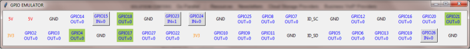

# GPIOEmulator



The easiest way to use this package is to install using pip for python 2.7

```bash
$ sudo pip install GPIOEmulator
```

using pip3 for python 3

```bash
$ sudo pip3 install GPIOEmulator
```

To use the emulator just type the following at the beginning of your script.

```python
>>> from GPIOEmulator.EmulatorGUI import GPIO
```

## Works with

- [python 2.7.15+](https://www.python.org/downloads/release/python-2715/)
- [python 3.6.8](https://www.python.org/downloads/release/3.6.8)

## Simulation

This library simulates the following functions which are used in the RPi.GPIO library.

- GPIO.setmode()
- GPIO.setwarnings()
- GPIO.setup()
- GPIO.input()
- GPIO.output()

## Test Example

``` python
from EmulatorGUI import GPIO
#import RPi.GPIO as GPIO
import time
import traceback
 
def Main():
    try:
        GPIO.setmode(GPIO.BCM)
 
        GPIO.setwarnings(False)
 
        GPIO.setup(4, GPIO.OUT)
        GPIO.setup(17, GPIO.OUT, initial = GPIO.LOW)
        GPIO.setup(18, GPIO.OUT, initial = GPIO.LOW)
        GPIO.setup(21, GPIO.OUT, initial = GPIO.LOW)
        GPIO.setup(23, GPIO.IN, pull_up_down = GPIO.PUD_UP)
        GPIO.setup(15, GPIO.IN, pull_up_down = GPIO.PUD_DOWN)
        GPIO.setup(24, GPIO.IN, pull_up_down = GPIO.PUD_DOWN)
        GPIO.setup(26, GPIO.IN)
 
        while(True):
            if (GPIO.input(23) == False):
                GPIO.output(4,GPIO.HIGH)
                GPIO.output(17,GPIO.HIGH)
                time.sleep(1)
 
            if (GPIO.input(15) == True):
                GPIO.output(18,GPIO.HIGH)
                GPIO.output(21,GPIO.HIGH)
                time.sleep(1)
 
            if (GPIO.input(24) == True):
                GPIO.output(18,GPIO.LOW)
                GPIO.output(21,GPIO.LOW)
                time.sleep(1)
 
            if (GPIO.input(26) == True):
                GPIO.output(4,GPIO.LOW)
                GPIO.output(17,GPIO.LOW)
                time.sleep(1)
 
    except Exception as ex:
        traceback.print_exc()
    finally:
        GPIO.cleanup() #this ensures a clean exit
 
Main()
```

## Credits

- Source Code :  [Roderick Vella](https://roderickvella.wordpress.com/2016/06/28/raspberry-pi-gpio-emulator/) , [xvlvx0](https://github.com/xvlvx0)

- Packaging & Distribution : [codenio](https://github.com/codenio)